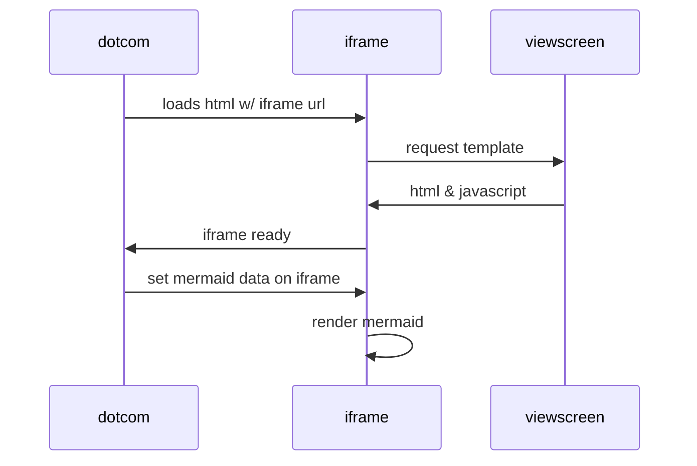

# CMS_UCV2 :man_technologist:
cms para la carga de informacion de la web olive

## :scroll: Descripcion
Este repositorio contiene código PHP para realizar la insercion y mantenimiento de la informacion de la web olive

## :art: Recursos
Meedo, el marco de base de datos PHP ligero para acelerar el desarrollo
* [https://medoo.in/](https://medoo.in/)  

